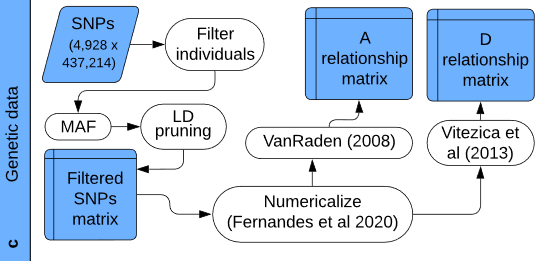
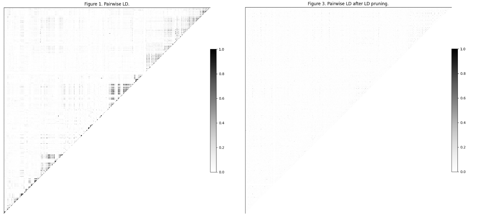
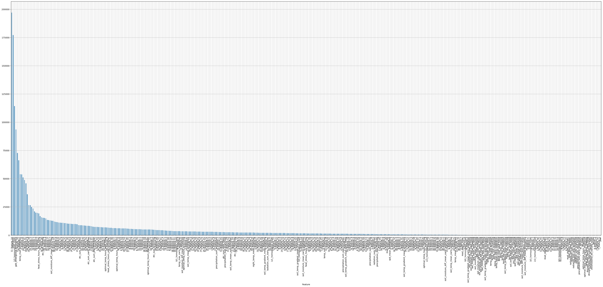

# Agrocode Hack Genetics

*MISIS Neychev Optimizer Team*

1) [**Груздев Александр**](https://github.com/gruzdev-as) - Captain (formal), ML
2) [**Рыжичкин Кирилл**](https://github.com/l1ghtsource) - ML
3) [**Литвинов Максим**](https://github.com/maksimlitvinov39kg) - ML 
4) [**Курочкин Вадим**](https://github.com/Vadimbuildercxx) - ML
5) [**Щелкунова Евгения**](https://github.com/jenyanya) - ML

Презентация: тык

## Кейс "Прогнозирование урожайности"

> Выход урожая — ключевая метрика для оценки успешности селекционного процесса, поэтому получение и отбор высокопродуктивных сортов — важная задача селекционера. Прогнозирование урожайности имеющихся в коллекции сортов позволит более эффективно выстраивать стратегию работы. На сегодняшний день имеются методы, основанные на статистике и машинном обучении, позволяющие использовать детальные данные о погоде за прошлые сезоны для прогнозирования выхода урожая, а также методы, использующие данные о геномах выращиваемых культур. Однако часто эти подходы используются независимо друг от друга. Совмещение этих подходов даст значительное увеличение точности предсказаний. Предложите, как может выглядеть подход, объединяющий детальные данные о почве и климате с геномными данными выращиваемых линий.

# Предложенное решение

## Блок-схема всего решения

тут умная схема сборки погодных данных, статистик, pca и подачи в модель

## Получение статистических признаков

Извлекаем статистические признаки из геномных данных, сгруппированных по образцам. Эта процедура позволяет получить количественные характеристики генетической информации, такие как распределение генотипов, профили хромосом, позиционные и аллельные особенности, глубину чтения и вероятность генотипов.

1. **Детальный генотипический анализ**:  
   Подсчитываются частоты различных генотипов (например, `0/0`, `0/1`, `1/1`, `./.`, и других). Это позволяет оценить распределение гомозиготных и гетерозиготных вариантов для каждого образца.

2. **Хромосомный профиль**:  
   Анализируется распределение генетических вариантов по хромосомам, включая абсолютное количество вариантов и их долю относительно общего числа вариантов в образце.

3. **Позиционный анализ**:  
   Исследуются пространственные характеристики расположения вариантов в геноме. Вычисляются такие показатели, как медиана, дисперсия, энтропия позиций, а также плотность распределения вариантов по геному.

4. **Аллельный анализ**:  
   Анализируется разнообразие аллелей. Подсчитываются частоты оснований (`A`, `T`, `G`, `C`) для референсных и альтернативных аллелей, а также вычисляется соотношение референсных и альтернативных аллелей.

5. **Анализ глубины чтения**:  
   Рассчитываются статистические показатели глубины чтения (среднее, медиана, стандартное отклонение, квартильные значения), что позволяет оценить качество секвенирования.

6. **Фред-вероятности (Phred-scaled likelihoods)**:  
   Извлекаются и анализируются вероятности генотипов в Phred-шкале. Вычисляются средние, максимальные значения и дисперсия вероятностей.

7. **Переходы между вариантами**:  
   Проводится анализ частот переходов между базами (например, `A → G`, `C → T` и т.д.), что может быть полезным для выявления характерных мутаций.

8. **Распределение типов вариантов**:  
   Генерируются типы замен (например, `A>G`, `C>T`), и их частоты нормализуются. Выводится распределение наиболее частых типов вариантов для каждого образца.

## Получение PCA признаков

Здесь мы решили реализовать идеи из статьи [Using machine learning to combine genetic and environmental data for maize grain yield predictions across multi‑environment trials](https://link.springer.com/content/pdf/10.1007/s00122-024-04687-w.pdf):

<p align="center">
  
</p>

В этом этапе проводится обработка генотипических данных, разделённых по хромосомам, для получения признаков на основе главных компонент (`PCA`). 
Данные предварительно очищаются с использованием прунинга на основе коэффициента связности (`LD`), чтобы минимизировать избыточность информации.



Для каждой хромосомы вычисляются векторы признаков, отражающие наиболее важные аспекты генетической вариативности, 
а также модель дисперсии `PCA`. Это позволяет эффективно обобщить сложные многомерные данные и подготовить их для дальнейшего анализа.

Итоговые признаки агрегируются в единую таблицу, которая сохраняется для последующего использования в статистическом анализе или моделировании.

## Получение погодных данных

тут завтра также написать про сбор погодных данных

## Финальная модель

Для построения ML-модели регрессии был выбран фреймворк LightAutoML и был обучен следующий ансамбль моделей:

```python
Final prediction for new objects (level 0) = 
	 0.31490 * (7 averaged models Lvl_0_Pipe_0_Mod_0_LinearL2) +
	 0.37158 * (7 averaged models Lvl_0_Pipe_1_Mod_2_CatBoost) +
	 0.31351 * (7 averaged models Lvl_0_Pipe_1_Mod_3_Tuned_CatBoost) 
```

Полный отчет об обучении модели: [report.html](logs/tabularAutoML_model_report_weather5/lama_interactive_report.html)

Ноутбук с разработкой модели: [best_model.ipynb](notebooks/best_model.ipynb)

## Итоговые метрики:

- **MAPE (Средняя абсолютная процентная ошибка): 0.1028**  
  **Пояснение:** Эта метрика измеряет среднюю относительную ошибку предсказания, выраженную в процентах. Значение \( 0.1028 \) говорит о том, что в среднем предсказания модели отклоняются от истинных значений на 10.28%. MAPE важен для оценки того, насколько существенны отклонения в реальных единицах измерения.

- **R² (Коэффициент детерминации): 0.2493**  
  **Пояснение:** Эта метрика показывает, какую долю дисперсии целевой переменной модель объясняет на тестовой выборке. Значение \( R^2 = 0.2493 \) указывает, что модель объясняет около 24.93% вариативности данных. Для задач регрессии эта метрика важна, так как позволяет оценить общую точность модели в терминах объяснённой дисперсии.

- **MAE (Средняя абсолютная ошибка): 10.2543**  
  **Пояснение:** MAE показывает среднюю абсолютную ошибку в тех же единицах, что и целевая переменная. Значение \( 10.2543 \) говорит о том, что в среднем предсказания модели отклоняются от реальных значений на 10.25. Эта метрика важна для интерпретации ошибок в понятных единицах измерения, что особенно полезно для оценки модели в реальных приложениях.

## Почему важны эти метрики?

- **R²** позволяет оценить общую "объясняющую способность" модели.
- **MAPE** даёт интерпретацию ошибок в относительных величинах, что полезно при работе с данными разных масштабов.
- **MAE** даёт представление о средних абсолютных ошибках, что важно для задач с критичными отклонениями.

Эти три метрики в совокупности дают всестороннюю оценку качества модели регрессии: как её способность объяснять данные (R²), так и точность предсказаний в абсолютных (MAE) и относительных (MAPE) терминах.

## Дополнение: важность признаков:


