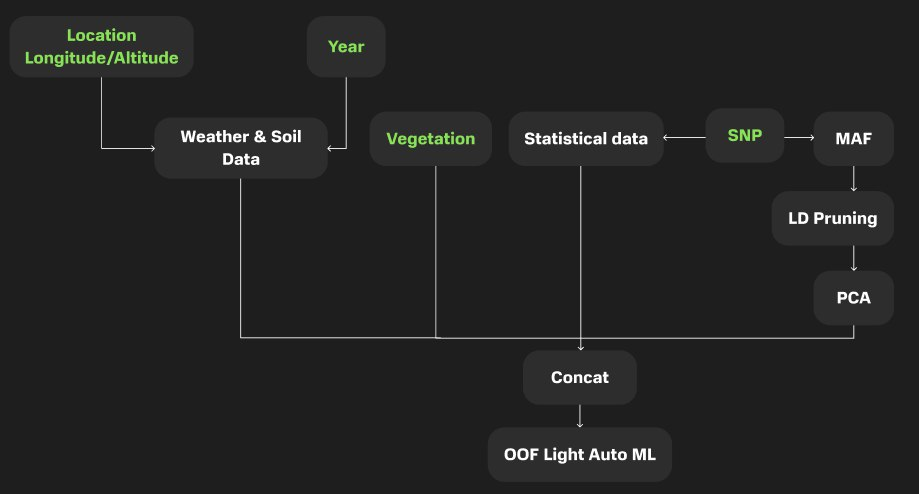

# Agrocode Hack Genetics

*MISIS Neychev Optimizer Team*

1) [**Груздев Александр**](https://github.com/gruzdev-as) - Captain (formal), ML
2) [**Рыжичкин Кирилл**](https://github.com/l1ghtsource) - ML
3) [**Литвинов Максим**](https://github.com/maksimlitvinov39kg) - ML 
4) [**Курочкин Вадим**](https://github.com/Vadimbuildercxx) - ML
5) [**Щелкунова Евгения**](https://github.com/jenyanya) - ML

Презентация: тык

## Кейс "Прогнозирование урожайности"

> Выход урожая — ключевая метрика для оценки успешности селекционного процесса, поэтому получение и отбор высокопродуктивных сортов — важная задача селекционера. Прогнозирование урожайности имеющихся в коллекции сортов позволит более эффективно выстраивать стратегию работы. На сегодняшний день имеются методы, основанные на статистике и машинном обучении, позволяющие использовать детальные данные о погоде за прошлые сезоны для прогнозирования выхода урожая, а также методы, использующие данные о геномах выращиваемых культур. Однако часто эти подходы используются независимо друг от друга. Совмещение этих подходов даст значительное увеличение точности предсказаний. Предложите, как может выглядеть подход, объединяющий детальные данные о почве и климате с геномными данными выращиваемых линий.

# Оглавление

1. [Участники команды](#участники-команды)
2. [Описание кейса](#кейс-прогнозирование-урожайности)
3. [Предложенное решение](#предложенное-решение)
    - [Блок-схема решения](#блок-схема-всего-решения)
    - [Получение статистических признаков](#получение-статистических-признаков)
    - [Получение PCA признаков](#получение-pca-признаков)
    - [Получение погодных данных](#получение-погодных-данных)
    - [Финальная модель](#финальная-модель)
    - [Итоговые метрики](#итоговые-метрики)
    - [Важность признаков](#дополнение-важность-признаков)
4. [Инструкция по запуску решения](#инструкция-по-запуску-решения)
    - [Клонирование репозитория](#1-клонирование-репозитория)
    - [Создание и активация виртуального окружения](#2-создание-и-активация-виртуального-окружения)
    - [Установка зависимостей](#3-установка-зависимостей)
    - [Подготовка данных](#4-подготовка-данных)
    - [Запуск проекта](#5-запуск-проекта)
    - [Кастомизация параметров](#6-кастомизация-параметров-опционально)
    - [Результаты](#7-результаты)
5. [Структура репозитория](#структура-репозитория)

# Предложенное решение

## Блок-схема всего решения



## Получение статистических признаков

Извлекаем статистические признаки из геномных данных, сгруппированных по образцам. Эта процедура позволяет получить количественные характеристики генетической информации, такие как распределение генотипов, профили хромосом, позиционные и аллельные особенности, глубину чтения и вероятность генотипов.

1. **Детальный генотипический анализ**:  
   Подсчитываются частоты различных генотипов (например, `0/0`, `0/1`, `1/1`, `./.`, и других). Это позволяет оценить распределение гомозиготных и гетерозиготных вариантов для каждого образца.

2. **Хромосомный профиль**:  
   Анализируется распределение генетических вариантов по хромосомам, включая абсолютное количество вариантов и их долю относительно общего числа вариантов в образце.

3. **Позиционный анализ**:  
   Исследуются пространственные характеристики расположения вариантов в геноме. Вычисляются такие показатели, как медиана, дисперсия, энтропия позиций, а также плотность распределения вариантов по геному.

4. **Аллельный анализ**:  
   Анализируется разнообразие аллелей. Подсчитываются частоты оснований (`A`, `T`, `G`, `C`) для референсных и альтернативных аллелей, а также вычисляется соотношение референсных и альтернативных аллелей.

5. **Анализ глубины чтения**:  
   Рассчитываются статистические показатели глубины чтения (среднее, медиана, стандартное отклонение, квартильные значения), что позволяет оценить качество секвенирования.

6. **Фред-вероятности (Phred-scaled likelihoods)**:  
   Извлекаются и анализируются вероятности генотипов в Phred-шкале. Вычисляются средние, максимальные значения и дисперсия вероятностей.

7. **Переходы между вариантами**:  
   Проводится анализ частот переходов между базами (например, `A → G`, `C → T` и т.д.), что может быть полезным для выявления характерных мутаций.

8. **Распределение типов вариантов**:  
   Генерируются типы замен (например, `A>G`, `C>T`), и их частоты нормализуются. Выводится распределение наиболее частых типов вариантов для каждого образца.

Скрипт: [stat.py](scripts/stat.py)

## Получение PCA признаков

Здесь мы решили реализовать идеи из статьи [Using machine learning to combine genetic and environmental data for maize grain yield predictions across multi‑environment trials](https://link.springer.com/content/pdf/10.1007/s00122-024-04687-w.pdf):

<p align="center">
  
</p>

В этом этапе проводится обработка генотипических данных, разделённых по хромосомам, для получения признаков на основе главных компонент (`PCA`). 
Данные предварительно очищаются с использованием прунинга на основе коэффициента связности (`LD`), чтобы минимизировать избыточность информации.


Для каждой хромосомы вычисляются векторы признаков, отражающие наиболее важные аспекты генетической вариативности, 
а также модель дисперсии `PCA`. Это позволяет эффективно обобщить сложные многомерные данные и подготовить их для дальнейшего анализа.

Итоговые признаки агрегируются в единую таблицу, которая сохраняется для последующего использования в статистическом анализе или моделировании.

Скрипт: [genom_pca.py](scripts/genom_pca.py)

## Получение погодных данных

### Парсинг и сбор погодных данных 
Скрипт собирает почасовые данные о погоде через API Open-Meteo, включая:
- Температуру воздуха и почвы
- Влажность и осадки
- Солнечную радиацию
- Скорость и направление ветра
- Облачность и давление

### Анализ периодов роста
Отслеживает 7 критических фаз роста сои:
1. Всходы (10 дней)
2. Ранняя вегетация (15 дней) 
3. Ветвление (15 дней)
4. Цветение (35 дней)
5. Формирование бобов (20 дней)
6. Налив семян (20 дней)
7. Созревание (15 дней)

### Выходные данные
- Метрики по каждому периоду роста
- Общие показатели за сезон

Скрипт: [get_weather_data.py](scripts/get_weather_data.py)

## Финальная модель

Для построения ML-модели регрессии был выбран фреймворк LightAutoML и был обучен следующий ансамбль моделей:

```python
Final prediction for new objects (level 0) = 
	 0.31490 * (7 averaged models Lvl_0_Pipe_0_Mod_0_LinearL2) +
	 0.37158 * (7 averaged models Lvl_0_Pipe_1_Mod_2_CatBoost) +
	 0.31351 * (7 averaged models Lvl_0_Pipe_1_Mod_3_Tuned_CatBoost) 
```

Модель принимает на вход статистические признаки и компоненты PCA-векторов, полученные из геномных данных, а также погодные данные, полученные из дополнительных ресурсов.

Полный отчет об обучении модели: [report.html](logs/tabularAutoML_model_report_weather5/lama_interactive_report.html)

Ноутбук с разработкой модели: [best_model.ipynb](notebooks/best_model.ipynb)

Скрипт: [lama_train.py](scripts/lama_train.py)

## Итоговые метрики:

- **MAPE (Средняя абсолютная процентная ошибка): 0.1028**  
  **Пояснение:** Эта метрика измеряет среднюю относительную ошибку предсказания, выраженную в процентах. Значение 0.1028 говорит о том, что в среднем предсказания модели отклоняются от истинных значений на 10.28%. MAPE важен для оценки того, насколько существенны отклонения в реальных единицах измерения.

- **R² (Коэффициент детерминации): 0.2493**  
  **Пояснение:** Эта метрика показывает, какую долю дисперсии целевой переменной модель объясняет на тестовой выборке. Значение 0.2493 указывает, что модель объясняет около 24.93% вариативности данных. Для задач регрессии эта метрика важна, так как позволяет оценить общую точность модели в терминах объяснённой дисперсии.

- **MAE (Средняя абсолютная ошибка): 10.2543**  
  **Пояснение:** MAE показывает среднюю абсолютную ошибку в тех же единицах, что и целевая переменная. Значение 10.2543 говорит о том, что в среднем предсказания модели отклоняются от реальных значений на 10.25. Эта метрика важна для интерпретации ошибок в понятных единицах измерения, что особенно полезно для оценки модели в реальных приложениях.

## Почему важны эти метрики?

- **R²** позволяет оценить общую "объясняющую способность" модели.
- **MAPE** даёт интерпретацию ошибок в относительных величинах, что полезно при работе с данными разных масштабов.
- **MAE** даёт представление о средних абсолютных ошибках, что важно для задач с критичными отклонениями.

Эти три метрики в совокупности дают всестороннюю оценку качества модели регрессии: как её способность объяснять данные (R²), так и точность предсказаний в абсолютных (MAE) и относительных (MAPE) терминах.

## Дополнение: важность признаков:


# Инструкция по запуску решения

## 1. Клонирование репозитория
Склонируйте репозиторий с помощью команды:
```bash
git clone https://github.com/gruzdev-as/AgroCode-Hack.git
cd AgroCode-Hack
```

## 2. Создание и активация виртуального окружения
Создайте виртуальное окружение, чтобы изолировать зависимости проекта:

- **Windows**:
  ```bash
  python -m venv venv
  venv\Scripts\activate
  ```

- **Linux/MacOS**:
  ```bash
  python3 -m venv venv
  source venv/bin/activate
  ```

## 3. Установка зависимостей
Установите необходимые библиотеки, указанные в файле `requirements.txt`:
```bash
pip install -r requirements.txt
```

## 4. Подготовка данных
1. Скачайте данные для проекта и разместите их в папке `data` в корневой директории репозитория.
2. Убедитесь, что структура папки `data` соответствует ожидаемой:
   ```
   AgroCode-Hack/
   ├── data/
   │   ├── genotypes.vcf
   │   ├── phenotypes.tsv
   │   ├── vegetation.tsv
   │   ├── ...
   ```

## 5. Запуск проекта
Для выполнения всего пайплайна запустите файл `main.py`:
```bash
python main.py
```


## 6. Кастомизация параметров (опционально)
Вы можете передавать параметры через командную строку для настройки различных этапов пайплайна.

### Аргументы для main.py

#### Параметры для загрузки погодных данных:
- `--lat1` (float, default=51.692479): Широта первой точки.
- `--lon1` (float, default=39.199195): Долгота первой точки.
- `--year_start1` (int, default=2015): Год начала данных для первой точки.
- `--year_end1` (int, default=2017): Год окончания данных для первой точки.
- `--lat2` (float, default=51.734513): Широта второй точки.
- `--lon2` (float, default=36.155477): Долгота второй точки.
- `--year_start2` (int, default=2019): Год начала данных для второй точки.
- `--year_end2` (int, default=2023): Год окончания данных для второй точки.

#### Параметры для генерации тренировочного датасета:
- `--vcf_path` (str, default='../data/genotypes.vcf'): Путь к VCF-файлу.
- `--csv_path` (str, default='../data/parsed_vcf.csv'): Путь для сохранения CSV-файла.
- `--h5_path` (str, default='../data/genotypes.h5'): Путь для сохранения HDF5-файла.
- `--weather_path` (str, default='../data/weather_season_data.csv'): Путь к файлу с погодными данными.
- `--phenotypes_path` (str, default='../data/phenotypes.tsv'): Путь к файлу с фенотипами.
- `--vegetation_path` (str, default='../data/vegetation.tsv'): Путь к файлу с данными о растительности.

#### Параметры для обучения модели:
- `--train_path` (str, default='../data/train_file.csv'): Путь к тренировочному датасету.
- `--n_threads` (int, default=4): Количество потоков для обучения.
- `--n_folds` (int, default=7): Количество фолдов для кросс-валидации.
- `--random_state` (int, default=52): Значение для воспроизводимости.
- `--timeout` (int, default=36000): Ограничение по времени обучения (в секундах).
- `--target_name` (str, default='target'): Имя целевой колонки.

### Пример запуска с кастомными параметрами
```bash
python main.py --train_path ../data/custom_train.csv --n_threads 8 --n_folds 10
```

## 7. Результаты
После успешного выполнения скрипта:
- Сгенерированные датасеты сохранятся в папке `data`.
- Метрики модели, важности признаков и полный отчет обучения будут выведены в консоль и сохранены в соответствующих файлах.

# Структура репозитория

```
logs/                         # Логи обучения моделей, а также важности фичей каждой из них
└── ...

notebooks/                    # Jupyter ноутбуки
├── best_model.ipynb          # Ноутбук с финальной лучшей моделью
├── eda.ipynb                 # Ноутбук с EDA
├── model_experiments.ipynb   # Ноутбук с тестированием разных признаков
└── train_generation.ipynb    # Ноутбук для генерации признаков

scripts/                      # Основные скрипты
├── generate_train_dataset.py # Скрипт для генерации train датасета
├── genom_pca.py              # Скрипт для генерации PCA-векторов из геномных данных
├── get_weather_data.py       # Скрипт для сборки погодных данных
├── lama_train.py             # Скрипт для обучения LAMA
├── mlflow_tracking.py        # Скрипт для трекинга метрик в MLFlow
├── stat.py                   # Скрипт для получения статистических признаков из геномных данных
└── utils.py                  # Скрипты для парсинга .vcf

README.md                     # Описание проекта
main.py                       # Основной скрипт для воспроизведения решения
requirements.txt              # Файл с зависимостями проекта
```
